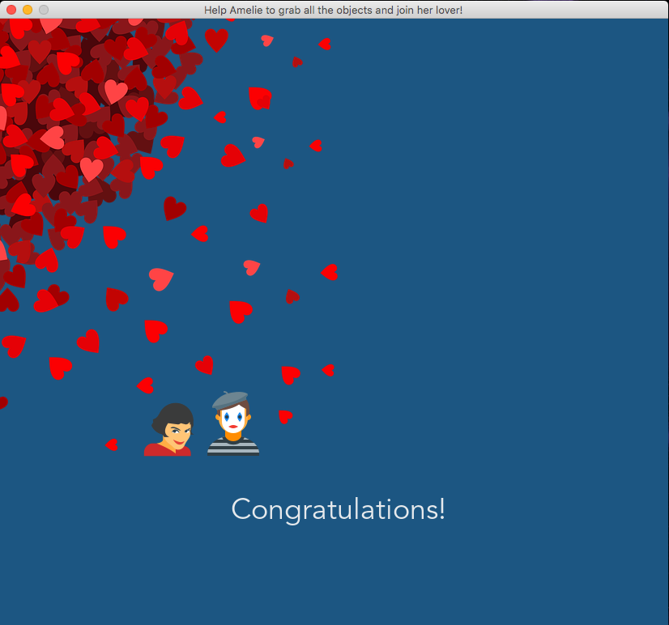

# Amelie's trip game

## Table of contents
* [General information](#general-information)
* [Prerequisites](#prerequisites)
* [Features](#features)
* [Illustrations](#illustrations)
* [Status](#status)
* [Contributing](#contributing)
* [Authors](#authors)
* [License](#license)

## General information

Amelie's trip is a video game using PyGame. 

In its initial version, the player has to grab random items in a labyrinth and reach the finish point in a limited time.

## Prerequisites

1- Install Python 3.7 \
2- Install PyGame 1.9.6

```
$ pip3 install pygame
```

## Features
* the labyrinth has 15 * 15 boxes
* the labyrinth is chosen randomly (3 different)
* the player moves from box to box using the arrow keys of the keyboard
* the player grabs objects as she passes over their location
* a counter is incremented each time the player picks up an object
* the 15 objects are randomly distributed in the labyrinth at each new opening of the game
* time is limited and materialized by a decreasing sidebar
* the player can at any time restart the game by pressing the space key

## Illustrations





Icons used in Amelie's trip game are [icons8](https://www.icons8.com) free licensed.

## Status

This project is in progress.

## Contributing

Pull requests are welcome. For major changes, please open an issue first to discuss what you would like to change.

Please make sure to update tests as appropriate.

## Authors

* Initial work: Stephanie BLANCHET, Data Science and Application Pythonist.
* Contact: stephanie.blanchet.it@gmail.com

## License

This project is licensed under the MIT License - see [MIT](https://choosealicense.com/licenses/mit/) for details.
